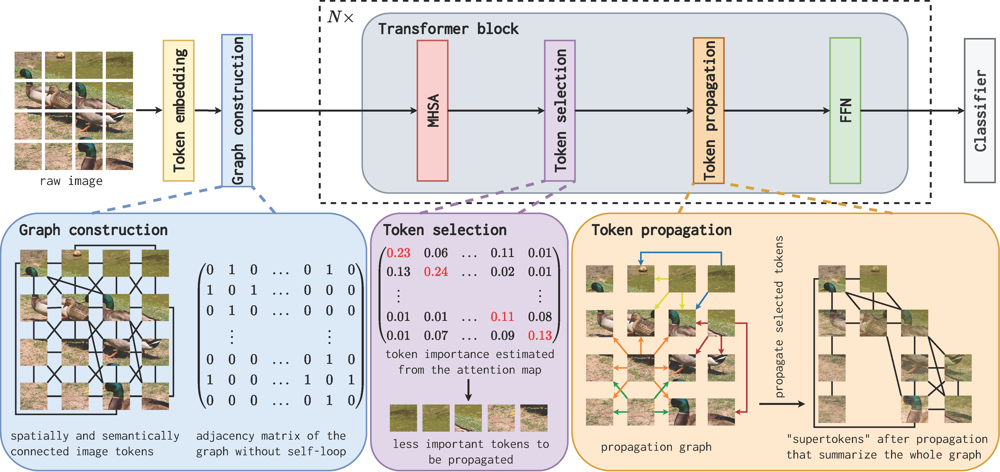

This is the official repository for paper
# GTP-ViT: Efficient Vision Transformers via Graph-based Token Propagation [WACV2024 Oral]

Paper: \[[WACV](https://openaccess.thecvf.com/content/WACV2024/papers/Xu_GTP-ViT_Efficient_Vision_Transformers_via_Graph-Based_Token_Propagation_WACV_2024_paper.pdf)\] \[[Arxiv](https://arxiv.org/abs/2311.03035)\]

Code: \[[GitHub](https://github.com/Ackesnal/GTP-ViT/)\]

## GTP-ViT Architecture Overview


## Usage

### Preparation

#### Environment installation

Install Python 3.8+, PyTorch and timm:

```
conda create -n gtp python=3.8.13
conda activate gtp
conda install pytorch==2.0.1 torchvision==0.15.2 torchaudio==2.0.2 pytorch-cuda=11.8 -c pytorch -c nvidia
pip install timm==0.9.2
pip install torchprofile
```

#### Data preparation

Download and extract ImageNet train and val images from http://image-net.org/.
The directory structure is the standard layout for the torchvision [`datasets.ImageFolder`](https://pytorch.org/docs/stable/torchvision/datasets.html#imagefolder), and the training and validation data is expected to be in the `train/` folder and `val` folder respectively:

```
/path/to/imagenet/
  train/
    class1/
      img1.jpeg
    class2/
      img2.jpeg
  val/
    class1/
      img3.jpeg
    class2/
      img4.jpeg
```

#### Pretrained model weights

Please download DeiT (and other backbones) pretrained models from their official repository or HuggingFace.

This method works as a pluggable component to existing ViT backbones. For example, you can simply download the DeiT-Small's model weight at https://dl.fbaipublicfiles.com/deit/deit_small_patch16_224-cd65a155.pth and apply our methods on DeiT-Small. We currently do not provide pretrained weights in this repository.

You can refer to the end of [models_v3.py](models_v3.py) to find all the backbones we support at the moment and download their model weights by yourself. These weights are usually available on HuggingFace.

### Evaluation

To evaluate GTP without training, run:

```
python -m torch.distributed.launch --nproc_per_node=1 --master_port=12345 --use_env main.py --data-path /path/to/imagenet/ --batch-size 256 --model graph_propagation_deit_small_patch16_224 --eval --resume /path/to/deit_small_patch16_224-cd65a155.pth --sparsity 1.0 --alpha 0.1 --num_prop 4 --selection MixedAttnMax --propagation GraphProp
```

You can adjust the arguments to explore difference results. Available values for these arguments can be found in main.py.

[TO BE FURTHER CONSTRUCTED]

## Reference
If our code or models help your work, please cite GTP-ViT:
```BibTeX
@inproceedings{xu2024gtp,
  title={GTP-ViT: Efficient Vision Transformers via Graph-based Token Propagation},
  author={Xu, Xuwei and Wang, Sen and Chen, Yudong and Zheng, Yanping and Wei, Zhewei and Liu, Jiajun},
  booktitle={Proceedings of the IEEE/CVF Winter Conference on Applications of Computer Vision (WACV)},
  pages={86--95},
  year={2024}
}
```
