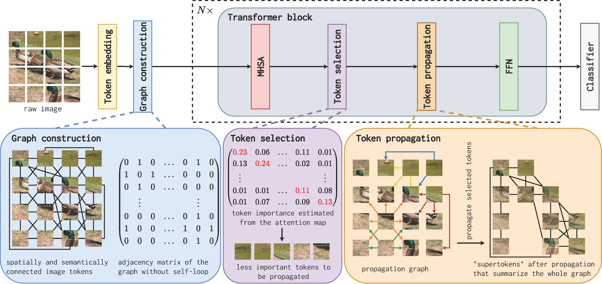

# Token Summarisation for Efficient Vision Transformers via Graph-based Token Propagation [WACV2024 Oral] [](https://arxiv.org/abs/2311.03035)

This is the official repository for __GTP-ViT__ 

## GTP-ViT Architecture Overview


## Environment Installation

Please install the following dependencies:

```
conda create -y -n gtp python=3.8.13
conda activate gtp
pip install torch==2.0.1 torchvision==0.15.2 torchaudio==2.0.2 --index-url https://download.pytorch.org/whl/cu118
pip install timm==0.9.2 torchprofile==0.0.4
```

_[Note] Newer versions of PyTorch and timm have not been tested with this repository, and might need adjustments._

## Dataset Preparation

Please download and extract ImageNet train and val images from http://image-net.org/.
The directory structure is the standard layout for the torchvision [`datasets.ImageFolder`](https://pytorch.org/docs/stable/torchvision/datasets.html#imagefolder), and the training and validation data is expected to be in the `train/` folder and `val/` folder respectively:

```
/path/to/imagenet/
  train/
    class1/
      img1.jpeg
    class2/
      img2.jpeg
  val/
    class1/
      img3.jpeg
    class2/
      img4.jpeg
```

## Model Weights Preparation

Please download ViT pre-trained models and place them in the `weights/` folder. This repository currently supports .pth and .safetensors weight types. You can find the pre-trained model weights from their original repositories or Hugging Face. Below are some links to the pre-trained models used in our paper:

| Base model | URL |
| --- | --- |
| DeiT-Ti-Patch16-224 | [Model download](https://dl.fbaipublicfiles.com/deit/deit_tiny_patch16_224-a1311bcf.pth) |
| DeiT-S-Patch16-224 | [Model download](https://dl.fbaipublicfiles.com/deit/deit_small_patch16_224-cd65a155.pth) |
| DeiT-B-Patch16-224 | [Model download](https://dl.fbaipublicfiles.com/deit/deit_base_patch16_224-b5f2ef4d.pth) |
| LVViT-S-Patch16-224 | [Model download](https://github.com/zihangJiang/TokenLabeling/releases/download/1.0/lvvit_s-26M-224-83.3.pth.tar) |
| LVViT-B-Patch16-224 | [Model download](https://github.com/zihangJiang/TokenLabeling/releases/download/1.0/lvvit_m-56M-224-84.0.pth.tar) |
| ViT-B-Patch8-224 | [Check link availability](gs://vit_models/augreg/B_8-i21k-300ep-lr_0.001-aug_medium2-wd_0.1-do_0.0-sd_0.0--imagenet2012-steps_20k-lr_0.01-res_224.npz) |
| ViT-L-Patch16-224 | [Check link availability](gs://vit_models/augreg/L_16-i21k-300ep-lr_0.001-aug_medium1-wd_0.1-do_0.1-sd_0.1--imagenet2012-steps_20k-lr_0.01-res_224.npz) |
| EVA-L-Patch14-196 | [Model download](https://huggingface.co/timm/eva_large_patch14_196.in22k_ft_in1k) |

Other pre-trained models can be used as well, but please make sure to include model definition in [models_v3.py](models_v3.py) and adjust evaluation command accordingly. You can also refer to the end of [models_v3.py](models_v3.py) to find all the backbones we support at the moment and download their model weights by yourself. These weights are usually available on HuggingFace.

## Optimal Hyperparameters

[hyperparameter_search.py](hyperparameter_search.py) contains the code for searching optimal hyperparameters. You can adjust the hyperparameter ranges and run it with:

```python
python hyperparameter_search.py
```

It will evaluate the model with different hyperparameter combinations and print the results. The results can be found under the `outputs/` folder.

For example, taking DeiT-B as the backbone, the optimal hyperparameters with `MixedAttnMax` token selection strategy, `Mixed` graph type, `GraphProp` propagation method, and `token scale` are:
| # Propagated tokens $P$ | Sparsity $\theta$ | Magnitude $\alpha$ | Accuracy |
| --- | --- | --- | --- |
| 1 | 0.8 | 0.1 | 81.93 |
| 2 | 0.7 | 0.1 | 81.85 |
| 3 | 0.9 | 0.4 | 81.76 |
| 4 | 1.0 | 0.4 | 81.76 |
| 5 | 0.6 | 0.15 | 81.70 |
| 6 | 0.6 | 0.15 | 81.67 |
| 7 | 0.6 | 0.1 | 81.57 |
| 8 | 0.6 | 0.1 | 81.46 |
| 9 | 0.7 | 0.2 | 81.37 |
| 10 | 0.5 | 0.2 | 81.22 |
| 11 | 0.8 | 0.3 | 81.04 |
| 12 | 0.8 | 0.3 | 80.81 |
| 13 | 0.7 | 0.3 | 80.52 |
| 14 | 0.8 | 0.3 | 80.11 |

## Reference
If our code or models help your work, please cite GTP-ViT:
```BibTeX
@inproceedings{xu2024gtp,
  title={GTP-ViT: Efficient Vision Transformers via Graph-based Token Propagation},
  author={Xu, Xuwei and Wang, Sen and Chen, Yudong and Zheng, Yanping and Wei, Zhewei and Liu, Jiajun},
  booktitle={Proceedings of the IEEE/CVF Winter Conference on Applications of Computer Vision (WACV)},
  pages={86--95},
  year={2024}
}
```
